# 🏥 Альметьевский Медицинский Колледж

Современный веб-сайт медицинского колледжа с полноценной админ-панелью для управления пользователями, расписанием, новостями и группами. **Готово к конкурсу с полным функционалом и красивым интерфейсом!**

**Версия:** v3.0 | **Статус:** ✅ Готово к конкурсу | **Последнее обновление:** 10 марта 2026

---

## ✨ Основные функции

### 👥 Для студентов
- 📅 **Расписание** - удобный просмотр расписания своей группы по дням
- 📰 **Новости и объявления** - актуальная информация о событиях колледжа
- 👤 **Личный кабинет** - профиль, информация о группе, контакты
- 🌐 **Мультиязычность** - интерфейс на русском и английском

### 👨‍🏫 Для преподавателей
- 📚 **Доступ к информации** - просмотр новостей и объявлений
- 🔐 **Защищённый доступ** - личный аккаунт с уникальными правами

### 🔐 Для администраторов
- **👥 Полное управление пользователями**
  - Добавление студентов, преподавателей, администраторов
  - Редактирование информации и ролей (Admin, Dean, Teacher, Student)
  - Удаление пользователей
  - Управление правами доступа

- **👫 Управление группами**
  - Создание новых групп
  - Добавление и удаление студентов
  - Информация о специальности и годе обучения

- **📅 Управление расписанием** ⭐ **ГЛАВНАЯ ФИШКА**
  - ✨ Выбор пар из предопределённого списка (вместо ручного ввода времени!)
  - 📋 7 пар с фиксированным временем (08:00–20:00)
  - 🔀 Выбор одной или нескольких пар одновременно
  - 📊 Просмотр расписания в виде таблицы по дням
  - ✏️ Быстрое редактирование
  - 📋 Дублирование похожих занятий
  - 🔍 Поиск и фильтрация
  - ⬇️ Экспорт в JSON

- **📰 Публикация новостей**
  - Создание на русском и английском языках
  - Загрузка изображений
  - Редактирование и удаление

- **📊 Статистика и аналитика**
  - Полная статистика пользователей
  - Метрики активности

### 🎬 Интерактивный тур для оргкомитета
- **📺 10 шагов демонстрации** - полный обзор всех функций
- **✨ Красивые анимации** - плавные переходы между страницами
- **🎨 Привлекательный дизайн** - темный градиент-интерфейс
- **📱 Адаптивность** - работает на всех устройствах
- **🎯 Удобная навигация** - быстрый переход между шагами

---

## � Галерея скриншотов

### 🏠 Главная страница
Красивая стартовая страница с привлекательным дизайном. Содержит 3 основные кнопки:
- **"Поступить к нам"** - информация о поступлении
- **"Узнать больше"** - подробная информация о колледже
- **"Демонстрация" 🟣** - интерактивный тур для оргкомитета

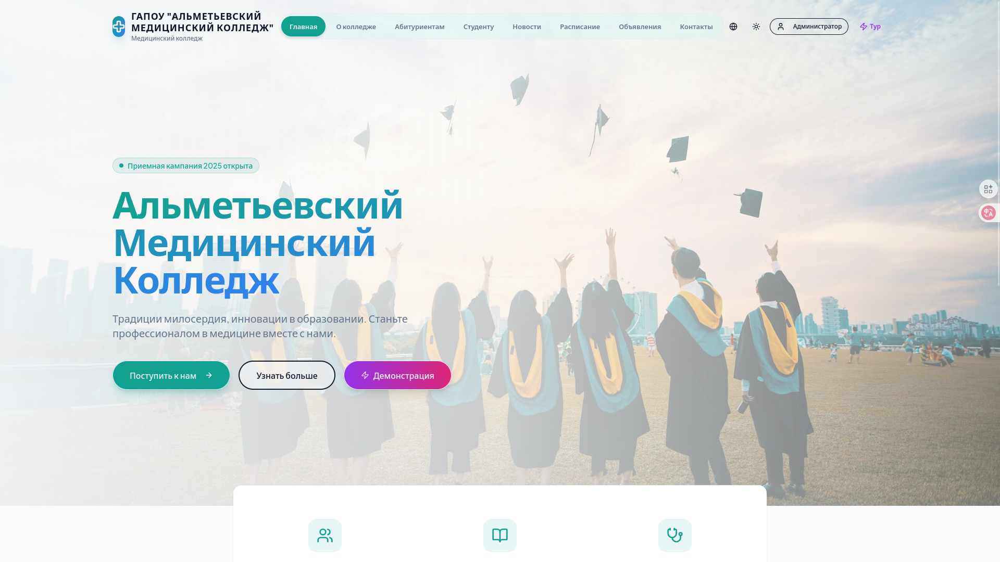

### 👥 О колледже
Раздел с информацией об учреждении:
- История колледжа (основан в 1990 году)
- Миссия и ценности
- Достижения студентов
- Информация о современном подходе к медицине и лабораториях

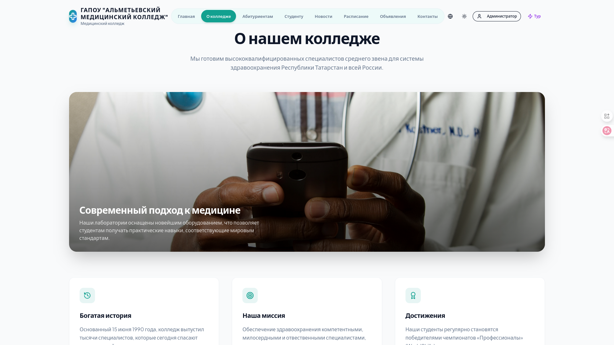

### 👨‍🎓 Студентам
Страница для студентов со всеми необходимыми ресурсами:
- Расписание занятий с кнопкой доступа
- Информация о специальностях (1, 2, 3 курсы)
- Внеучебная деятельность студентов
- Быстрый доступ к медицине, контактам и ресурсам

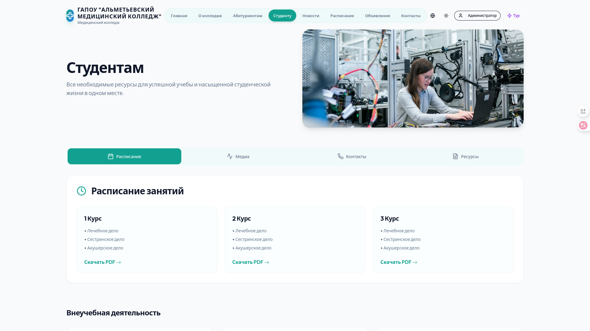

### 📰 Новости
Раздел новостей с красивыми карточками:
- **"День открытых дверей"** - информация о событии
- **"Студенческая научная конференция"** - достижения студентов
- **"Новое оборудование для практических занятий"** - инновационный подход
- Функция поиска и добавления новостей (для администраторов)

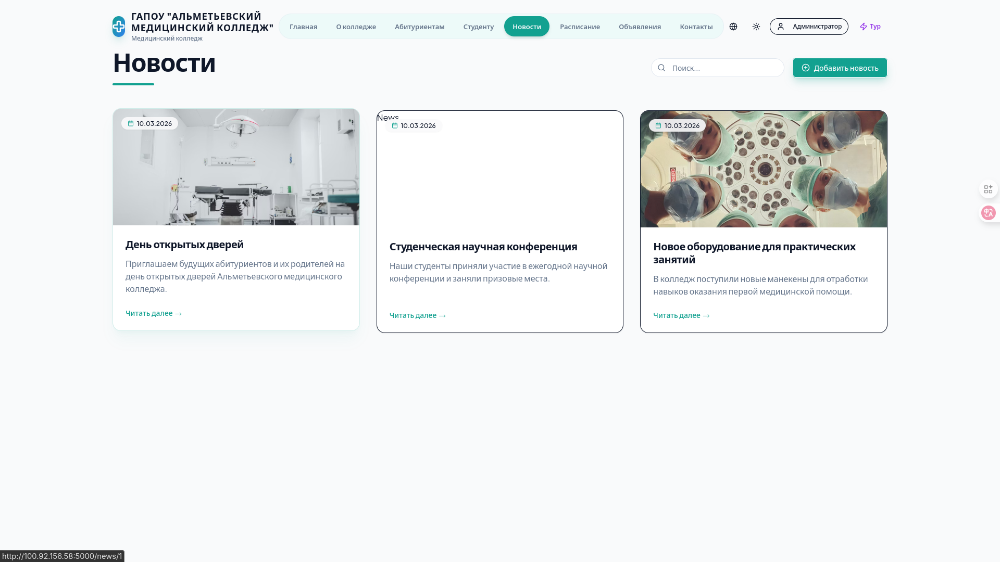

### 📅 Расписание
Интерактивное расписание для студентов:
- Выбор группы из списка
- Просмотр всех занятий в удобном формате
- Интеграция в основной интерфейс колледжа

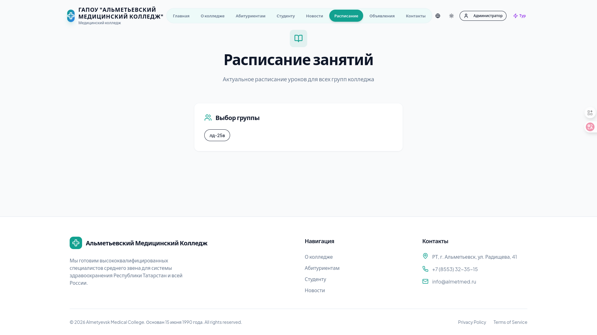

### 🔔 Объявления
Раздел важных объявлений:
- **"Важно! Начало учебного года"** - красные уведомления ⚠️
- **"Профилактическое обслуживание"** - жёлтые предупреждения
- **"Новые курсы повышения квалификации"** - голубые информационные сообщения
- Система цветового обозначения срочности

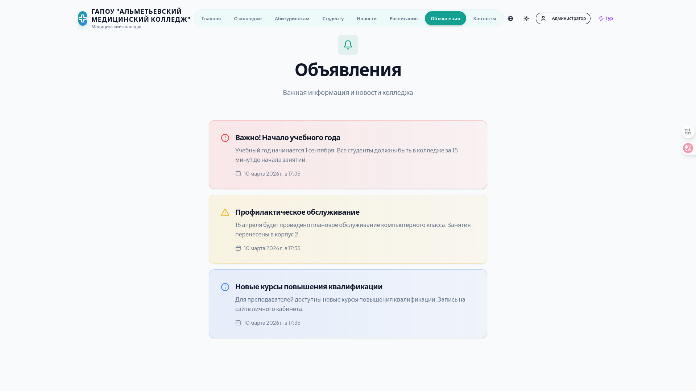

### 📞 Контакты
Полная информация для связи:
- **Адрес:** Альметьевск, ул. Шевченко, д. 2Г
- **Телефон:** +7 (8553) 43–43–34
- **Режим работы:** Пн–пт 8:00–17:00
- Контакты отделов
- Полезная информация о приёмной комиссии

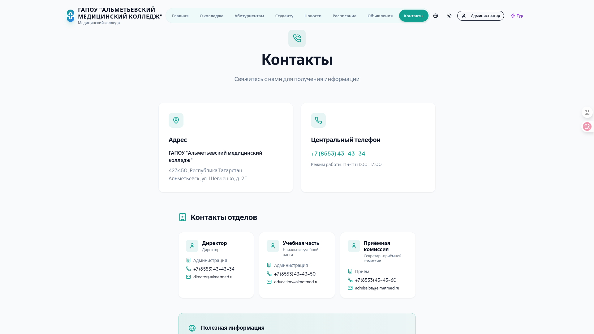

### 🔐 Админ-панель - Главная
Приветственный интерфейс администратора:
- Надпись "Добро пожаловать, Администратор!"
- Быстрый доступ к основным функциям через табы:
  - Статистика
  - Управление расписанием
  - Просмотр расписания
  - Группы
  - Пользователи


### 📊 Статистика системы
Панель аналитики администратора:
- **Всего пользователей:** 1
- **Группы:** 0
- **Новостей:** 3
- **Администраторов:** 1

Распределение по ролям:
- Администраторы: 1
- Завучи: 0
- Преподаватели: 0
- Студенты: 0

Последние новости с датами публикации

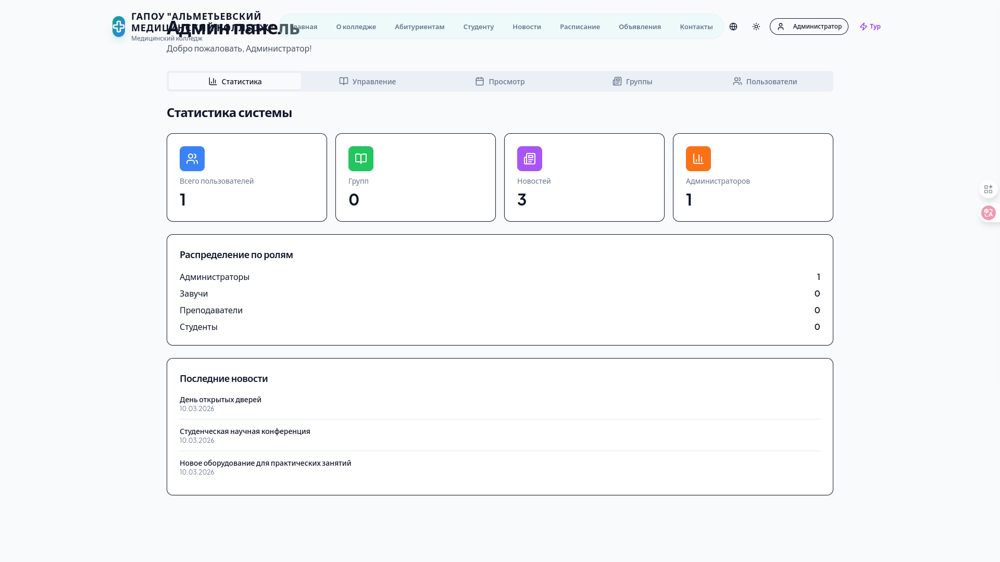

### 📚 Управление расписанием
Главный инструмент для создания расписания:
- Фильтрация по группам и дням
- **⭐ ГЛАВНАЯ ФИШКА:** Выбор пар из предопределённого списка
- Таблица занятий с:
  - Временем занятия
  - Названием предмета (Анатомия)
  - Группой (ла-25в)
  - Кабинетом (234, 104)
- Функции редактирования, дублирования, удаления

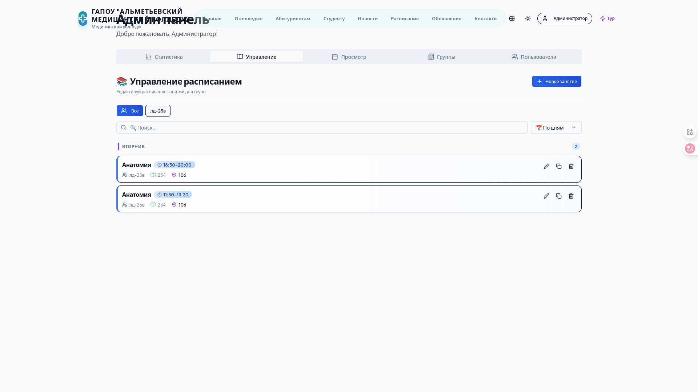

### 📋 Просмотр расписания
Таблица расписания в удобном формате:
- Выбор группы из выпадающего списка
- Выбор дня недели (Понедельник, Вторник и т.д.)
- Визуализация всех 7 пар в таблице

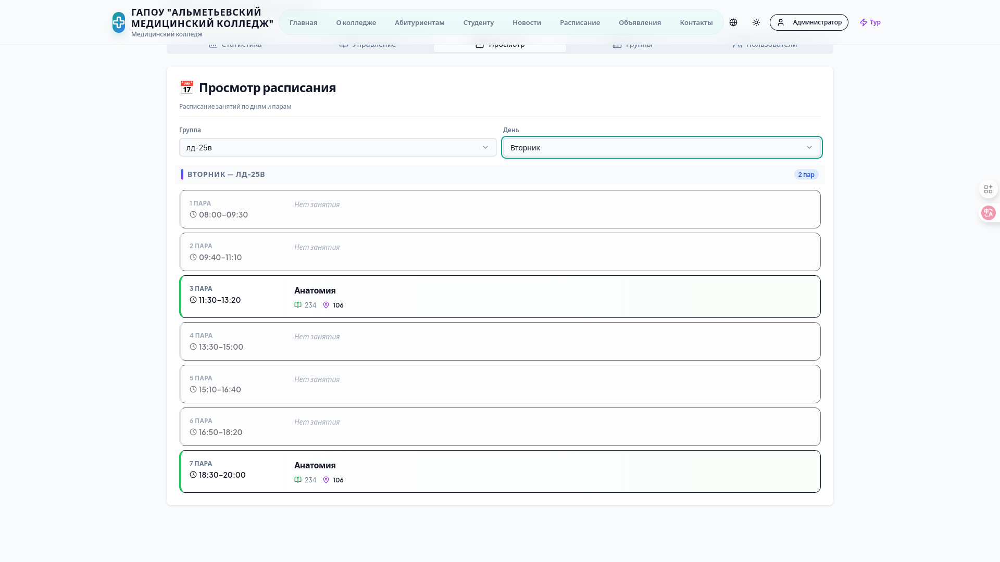

### 👫 Создание новой группы
Форма добавления группы студентов:
- Поле "Название группы" (например, М-101)
- Поле "Специальность" (например, Медсестра)
- Кнопка "Создать группу"

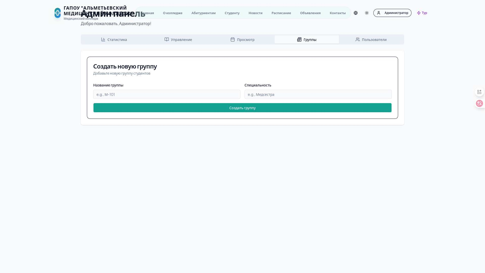

### 👤 Управление пользователями
Список всех пользователей системы:
- Информация об администраторе (admin@almetmed.ru)
- Роль пользователя
- Кнопки редактирования и удаления
- Кнопка добавления нового пользователя

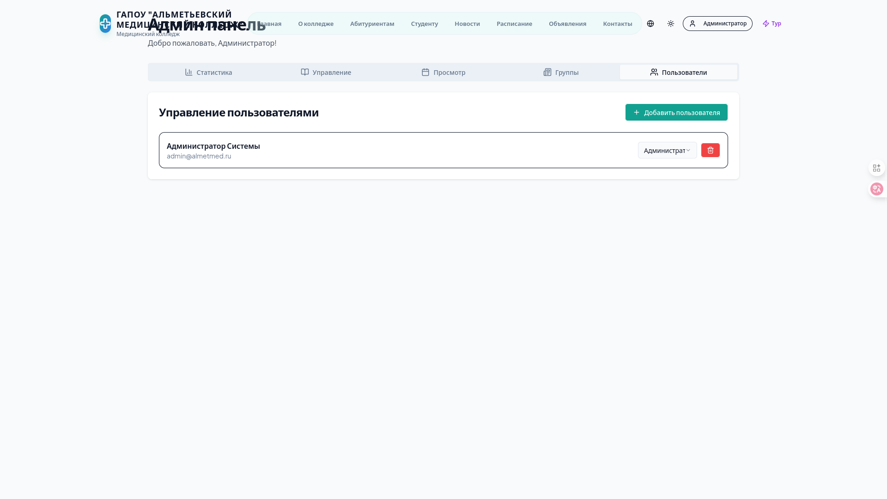

---

## 🚀 Быстрый старт (2 минуты)

> **💡 Заметка о скриншотах:** Все скриншоты выше находятся в папке `img/`. Чтобы они отображались на GitHub, нужно загрузить PNG-файлы со скриншотами. Смотри `img/README.md` для инструкций.
### Способ 1: Python лаунчер (Рекомендуется)

```bash
python run.py
```

Откроется интерактивное меню со всеми командами.

### Способ 2: Прямой запуск через npm

```bash
npm install      # Установка зависимостей (первый раз)
npm run dev      # Запуск сервера разработки
```

Откройте браузер: **http://localhost:5173**

### 🎬 Запуск демонстрационного тура

1. **На главной странице** → нажмите кнопку **"Демонстрация" 🟣**
2. **В навбаре** → нажмите кнопку **"Тур" ⚡**
3. **В мобильном меню** → нажмите **"Запустить демонстрацию"**

Следуйте инструкциям и смотрите все возможности!

---

## 📋 Требования для установки

- **Node.js** 16+ ([скачать](https://nodejs.org/))
- **npm** 7+ (устанавливается с Node.js)
- **Python 3** (для интерактивного лаунчера, опционально)

### Проверка версий
```bash
node --version    # Должно быть v16+
npm --version     # Должно быть 7+
```

---

## 📚 Основные команды

```bash
# Интерактивный лаунчер с меню
python run.py

# Разработка (с горячей перезагрузкой)
npm run dev

# Сборка для продакшена
npm run build

# Запуск собранного проекта
npm start

# Проверка типов TypeScript
npm run check

# Синхронизация БД
npm run db:push
```

---

## 🎬 Интерактивный тур (10 шагов)

### Часть 1: Основные страницы (6 шагов)
1. 🏠 Главная страница - красивый интерфейс с информацией
2. 📰 Новости - все новости и объявления
3. 📅 Расписание - расписание занятий студентов
4. 👥 О колледже - информация об учреждении
5. 📞 Контакты - все контакты и адрес
6. 🔐 Аутентификация - система входа

### Часть 2: Админ-панель (4 шага)
7. 📊 Статистика - аналитика и метрики
8. 📚 **Управление расписанием** - выбор пар, редактирование
9. 👤 Управление пользователями - CRUD операции
10. 👫 Управление группами - создание и управление

---

## 👨‍💼 Управление пользователями

### Вход в админ-панель
- **URL:** http://localhost:5173/admin
- **Email:** admin@almetmed.ru
- **Пароль:** admin

### Создание нового пользователя
1. Админ-панель → вкладка **"Пользователи"**
2. Нажать **"Добавить пользователя"**
3. Заполнить форму:
   - Имя, фамилия
   - Email (уникальный)
   - Роль: Admin / Dean / Teacher / Student
   - Группа (для студентов)
4. Нажать **"Сохранить"**
5. Система создаст временный пароль

### Управление ролями
- **Admin** - полный доступ
- **Dean** - расписание и новости
- **Teacher** - собственные новости
- **Student** - просмотр информации

---

## 📅 Управление расписанием ⭐

### ГЛАВНАЯ ФИШКА: Выбор пар из списка

**7 предопределённых пар:**
```
1 Пара:  08:00 – 09:30
2 Пара:  09:40 – 11:10
3 Пара:  11:30 – 13:20
4 Пара:  13:30 – 15:00
5 Пара:  15:10 – 16:40
6 Пара:  16:50 – 18:20
7 Пара:  18:30 – 20:00
```

### Добавление занятия
1. Админ-панель → **"Управление расписанием"**
2. Нажать **"Новое занятие"**
3. Заполнить:
   - Группа, предмет, преподаватель, кабинет
   - День недели
   - **Выбрать пару(ы)** (одну или несколько!)
4. Нажать **"Сохранить"**

### Просмотр расписания в таблице
1. Админ-панель → вкладка **"Просмотр"**
2. Выбрать группу и день
3. Видите таблицу всех 7 пар:
   - Зелёные = занятие
   - Серые = свободно

### Функции
- 🔍 Поиск по группе, предмету, преподавателю
- 📊 Сортировка (по дням, группам, времени)
- ✏️ Редактирование
- 📋 Дублирование
- 🗑️ Удаление
- ⬇️ Экспорт в JSON

---

## 👫 Управление группами

### Создание группы
1. Админ-панель → **"Группы"**
2. Нажать **"Создать группу"**
3. Заполнить:
   - Название: ПВ-201
   - Специальность: Сестринское дело
   - Год обучения: 1-4
4. Нажать **"Создать"**

### Добавление студентов
1. Выбрать группу
2. Нажать **"Добавить студентов"**
3. Выбрать из списка
4. Сохранить

---

## 📰 Управление новостями

### Публикация
1. **"Добавить новость"**
2. Заполнить:
   - Заголовок (РУ/EN)
   - Текст (РУ/EN)
   - Изображение
3. Нажать **"Опубликовать"**

### Редактирование/Удаление
- Нажать ✏️ для редактирования
- Нажать 🗑️ для удаления

---

## 📁 Структура проекта

```
College-Site-Maker/
├── client/                  # React фронтенд
│   └── src/
│       ├── components/
│       │   ├── DemoTour.tsx     # ⭐ Демо-тур
│       │   ├── admin/
│       │   │   ├── ScheduleManager.tsx
│       │   │   ├── ScheduleViewer.tsx
│       │   │   └── UserManager.tsx
│       │   └── ...
│       └── pages/
├── server/                  # Express бэкенд
│   ├── index.ts
│   ├── routes.ts
│   ├── db.ts
│   └── ...
├── shared/                  # Общие типы
├── database/                # SQLite БД
└── package.json
```

---

## 🛠️ Технологии

**Фронтенд:** React 18, TypeScript, Vite, Tailwind CSS, shadcn/ui
**Бэкенд:** Express 5, SQLite, Drizzle ORM, JWT
**DevOps:** Node.js, npm, Tailwind CLI, Drizzle Kit

---

## 🚀 Развертывание

### Production сборка
```bash
npm run build      # Создать production версию
npm start          # Запустить
```

### Docker (опционально)
```dockerfile
FROM node:18-alpine
WORKDIR /app
COPY . .
RUN npm install && npm run build
EXPOSE 5173
CMD ["npm", "start"]
```

---

## 🐛 Решение проблем

### Порт 5173 занят
```bash
lsof -i :5173 | grep LISTEN | awk '{print $2}' | xargs kill -9
```

### Ошибка модулей
```bash
rm -rf node_modules package-lock.json && npm install
```

### Проблемы с БД
```bash
npm run db:push
```

---

## ♿ Доступность

- ✅ Адаптивный дизайн (мобайл, планшет, ПК)
- ✅ Тёмная тема
- ✅ Клавиатурная навигация
- ✅ Мультиязычность (РУ/EN)

---

## 📞 Контакты

**Альметьевский Медицинский Колледж**
- 📧 amk-almet@mail.ru
- ☎️ +7 (8553) 43-43-34
- 📍 Альметьевск, ул. Шевченко, д. 2Г

---

## 📄 Лицензия

**Creative Commons Attribution 4.0 (CC BY 4.0) + Apache 2.0**

### Вы можете:
- ✅ **Использовать** код в личных и коммерческих проектах
- ✅ **Модифицировать** и адаптировать код под свои нужды
- ✅ **Распространять** код и производные работы
- ✅ **Адаптировать** под свои образовательные учреждения

### При условии:
- 📝 **Указания авторства** - обязательно указывайте автора оригинального проекта
- 🔗 **Ссылка на оригинальный репозиторий** - добавьте ссылку на исходный код
- 📌 **Указания изменений** - если вносили изменения, опишите их
- 📄 **Копия лицензии** - прилагайте текст этой лицензии

### Обязательное указание авторства:

```
Создано на основе College-Site-Maker
Альметьевский Медицинский Колледж
Оригинальный репозиторий: [ссылка на GitHub]

Автор: Хусаенова Диана Наилевна
Дата создания: 10 марта 2026
```

**Полный текст CC BY 4.0:** https://creativecommons.org/licenses/by/4.0/

---

**🎊 ГОТОВО К КОНКУРСУ! 🚀**

Все функции реализованы. Просто откройте сайт и нажмите "Демонстрация"!

*Последнее обновление: 10 марта 2026*
